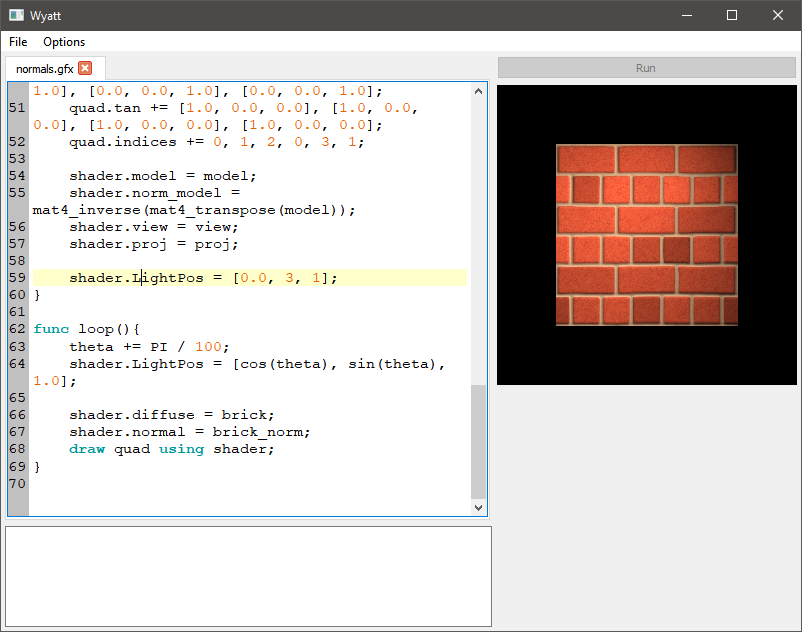

# Wyatt 
Wyatt is a programming language and a development environment for graphics programming. 

> **WARNING**: While the basic features are there, it is still in an early and buggy alpha state

# Getting Started
Starting the program is as simple as running the binary executable. The `docs` directory contain useful information on how to use the programming language. The `code` directory contains some code samples and some useful utility code (`utils.gfx` and `shapes.gfx`)

If you are an experienced OpenGL developer, then `docs/MANUAL.md` will teach you how the language abstracts the OpenGL API. If you are new to graphics progrmaming, then `docs/TUTORIAL.md` will introduce you to the concepts.


## Hello Triangle
```python
vert basic(vec3 pos) {

    func main() {
        FinalPosition = [pos, 1.0];
    }

}(vec4 FinalPosition)

frag basic() {

    func main() {
        FinalColor = [1.0, 1.0, 1.0, 1.0];	
    }

}(vec4 FinalColor)

buffer tri;

func init(){
    tri.pos += [1.0, -1.0, 0.0], [0.0, 1.0, 0.0], [-1.0, -1.0, 0.0];
}

func loop(){
    draw tri using basic;
}
```

# Building from source
Wyatt has been successfully compiled on Ubuntu 16.04/18.04 (using CMake, QMake, and Qt Creator) and Windows 10 (Using Qt Creator). Your mileage may vary, so feel free to submit an issue if there are any problems with building.
Building Wyatt generally requires:
1. gcc compiler and make
1. Flex 2.6
1. Bison 3.0.4
Other requirements will depend on what build type you are using

## Using CMake
Additional requirements
1. CMake 3.3
1. Qt 5.0
1. `stb_image.h` (place it in CMake's build directory)

(While other version of the above tools might work, the ones listed above are the ones I personally use to build)

Clone the repo, create a `build` folder inside it, then run CMake on the source directory. Then, run make on the generated Makefile in the build directory.
```
git clone https://github.com/Anheurystics/Wyatt
mkdir build && cd build
cmake ..
make
./wyatt
```

## Using Qt Creator / QMake
Additional requirements
1. Qt Creator
1. `stb_image.h` (place it in `src/lang`)

If you have QtCreator installed, you can open the project file (`wyatt.pro`) and build from there. You can also use qmake to generate the Makefile, although the Makefile would be in the root directory, with builds going in separate release and debug directories.
```
qmake
make
release/wyatt # Run release build
debug/wyatt   # Run debug build
```

# License
Wyatt (both the IDE and language) is licensed under the GPLv3 license.

